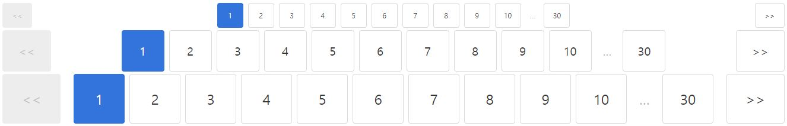
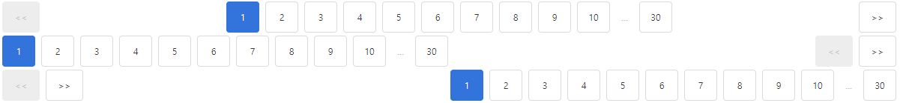

# NgxBulmaPagination

Angular + [Bulma - pagination](https://bulma.io/documentation/components/pagination/)


## Quick Start

1. Install packages

```shell
npm i --save bulma ngx-bulma-pagination
```

2. Import a module

```typescript
// app.module.ts

...
import { NgxBulmaPaginationModule } from "ngx-bulma-pagination";

@NgModule({
  ...,
  imports: [
    ...,
    NgxBulmaPaginationModule
  ],
  ...
})
export class AppModule { }
```

3. Using a component

```html
<ngx-bulma-pagination ...></ngx-bulma-pagination>
```


## Example

### Basic

* max : Total count. default is ``100``.
* count : Number of buttons per group. default is ``10``.

```html
<ngx-bulma-pagination [max]="30" [count]="10" (pageChange)="pageChange($event)"></ngx-bulma-pagination>
```

</img>


### Style

* isRounded : ``false``(square, default), ``true``(rounded)

```html
<ngx-bulma-pagination [max]="30" [count]="10" (pageChange)="pageChange($event)" [isRounded]="true"></ngx-bulma-pagination>
```

</img>

### Size

* size : ``is-small`` (default), ``is-medium``, ``is-large``

```html
<ngx-bulma-pagination [max]="30" [count]="10" (pageChange)="pageChange($event)" [size]="'is-small'"></ngx-bulma-pagination>
<ngx-bulma-pagination [max]="30" [count]="10" (pageChange)="pageChange($event)" [size]="'is-medium'"></ngx-bulma-pagination>
<ngx-bulma-pagination [max]="30" [count]="10" (pageChange)="pageChange($event)" [size]="'is-large'"></ngx-bulma-pagination>
```

</img>


### Alignment

* size : ``is-centered`` (default), ``is-left``, ``is-right``

```html
<ngx-bulma-pagination [max]="30" [count]="10" (pageChange)="pageChange($event)" [order]="'is-centered'"></ngx-bulma-pagination>
<ngx-bulma-pagination [max]="30" [count]="10" (pageChange)="pageChange($event)" [order]="'is-left'"></ngx-bulma-pagination>
<ngx-bulma-pagination [max]="30" [count]="10" (pageChange)="pageChange($event)" [order]="'is-right'"></ngx-bulma-pagination>
```

</img>


### Previous, Next

* previous : default is ``<<``
* next : default is ``>>``

```html
<ngx-bulma-pagination [max]="30" [count]="10" (pageChange)="pageChange($event)" [previous]="'←'" [next]="'→'"></ngx-bulma-pagination>
```

</img>
